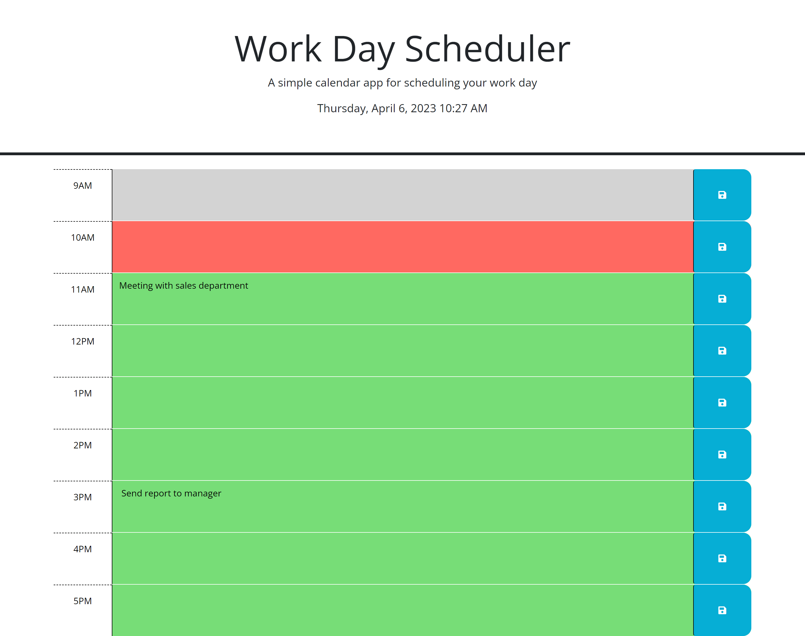

# Work Day Scheduler
Welcome to the README file for the Work Day Scheduler!

## Description
The Work Day Scheduler is a web-based application that allows users to manage their daily schedule from 9am to 5pm. Users can input and save their tasks for each hour of the day, and the application will color-code the tasks based on whether they are in the past, present, or future.

## Installation
No Installation Required. To use the Work Day Scheduler, simply navigate to the website.

## Usage
- Adding tasks: To add a task, simply click on the input field for the corresponding hour and type in the task. Once you have entered the task, click the "Save" button to save the task. The task will now be displayed in the hour's text area.

- Updating tasks: To update a task, click on the task in the text area and make your changes. Once you have made your changes, click the "Save" button to save the updated task.

- Removing tasks: To remove a task, just delete the text from the hour's text area and click the "Save" button to save the empty text area.

- Viewing tasks: Tasks for each hour of the day will be displayed in their corresponding text areas. The current hour will be highlighted in red, hours in the past will be highlighted in gray, and hours in the future will be highlighted in green.

## Files
- index.html: This is the main HTML file for the scheduler.
- style.css: This file contains the styles.
- script.js: This file contains the JavaScript and Jquery code that runs the Work Day Scheduler.

## License
- The Work Day Scheduler is licensed under the MIT License.

# Screenshot and link for the deployed application

[Link deployed application](https://elisamarchete.github.io/work-day-scheduler/)

